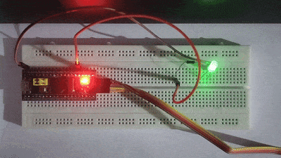

# Bare-Metal Blinky LED for GD32F103C8T6

A simple yet powerful project that demonstrates direct hardware control on the GD32F103C8T6 microcontroller. This project implements a classic "blinky" LED program by directly manipulating the microcontroller's GPIO and RCC registers, completely bypassing a hardware abstraction layer (HAL).

This bare-metal approach offers a direct path to understanding the low-level mechanics of the GD32F103C8T6. A key part of this project involved configuring the Reset and Clock Control (RCC) peripheral to operate the microcontroller at a custom speed of 104 MHz, showcasing an in-depth understanding of the chip's clock tree. This results in highly efficient code and robust debugging skills—essential for any serious embedded systems developer.

## GD32F103C8T6 Microcontroller Specifications
* **Core & Architecture**
    * **Core:** Cortex®-M3
    * **Series:** GD32F103
    * **Package:** LQFP48
    * **Max Speed:** 108 MHz
    * **Operating Speed:** 104 MHz (Custom configured)

* **Memory**
    * **Flash:** 64 KB
    * **SRAM:** 20 KB

* **Peripherals**
    * **I/O Pins:** up to 37
    * **Timers:** 3x 16-bit GPTM, 1x 16-bit Advanced TM, 1x 24-bit SysTick
    * **Watchdogs:** 2
    * **RTC:** 1
    * **Communication:**
        * **USART:** 3
        * **I2C:** 2
        * **SPI:** 2
        * **CAN:** 1 (CAN 2.0B)
        * **USB:** 1 (2.0 Full-speed)
    * **ADC:** 2 units (10 channels, 12-bit)
